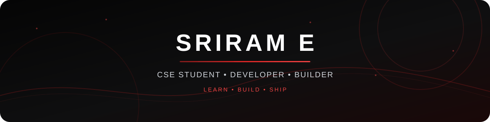

<div align="center">



<br/>


<br/><br/>

<a href="https://github.com/Jaisrir"></a>
&nbsp;
<a href="https://www.linkedin.com/in/sriram-e/"></a>
&nbsp;
<a href="mailto:sriram.cse.elangovan@gmail.com"></a>

<br/><br/>


</div>

---

## 👨‍💻 About Me

<table width="100%">
<tr>
<td width="55%" valign="top">

### Hey there! 👋

I'm **Sriram E**, a Computer Science Engineering student passionate about software development, web technologies, and building practical projects.

I enjoy taking an idea from **concept → code → working product** and learning something new with every project.

- 🔭 Building web development projects
- 🌱 Learning full-stack development
- 💡 Interested in AI and modern software
- 🧠 Improving DSA and problem solving
- 🚀 Open to learning and collaboration

</td>
<td width="45%" valign="top">

```text
┌──────────────────────────────┐
│        SRIRAM E              │
├──────────────────────────────┤
│ 🎓 CSE Student               │
│ 💻 Developer                 │
│ 🌐 Web Development           │
│ 🤖 AI Explorer               │
│ 🚀 Project Builder           │
│ 📚 Lifelong Learner          │
└──────────────────────────────┘
```

</td>
</tr>
</table>

---

## ⚡ Tech Stack

<div align="center">


<br/><br/>


</div>

---

## 🔥 What I'm Working On

<table width="100%">
<tr>
<td width="50%" align="center">

### 🔭 Flagship Project

**Building & improving real-world web applications**

<sub>Frontend • Backend • APIs • Deployment</sub>

</td>
<td width="50%" align="center">

### 🌱 Active Deep Dive

**Full Stack Development**

<sub>React • Node.js • Databases • System Design</sub>

</td>
</tr>

<tr>
<td width="50%" align="center">

### 🧠 Problem Solving

**DSA & programming fundamentals**

<sub>Algorithms • Data Structures • Logical Thinking</sub>

</td>
<td width="50%" align="center">

### 🤝 Collaboration

**Open to interesting projects**

<sub>Web • AI • Software Development</sub>

</td>
</tr>
</table>

---

## 🚀 Featured Projects

<table width="100%">
<tr>
<td width="50%" valign="top">

### 🎮 XO Game

An interactive Tic-Tac-Toe game built to practice frontend development and JavaScript logic.

**Stack:** `HTML` `CSS` `JavaScript`

<a href="https://github.com/Jaisrir/xo_game">

</a>

</td>

<td width="50%" valign="top">

### 📝 Face Prep Project

A frontend project created while practicing web development and user interface design.

**Stack:** `HTML` `CSS` `JavaScript`

<a href="https://github.com/Jaisrir/Face_prep_project">

</a>

</td>
</tr>

<tr>
<td width="50%" valign="top">

### 📋 Registration Form

A clean registration interface focused on HTML forms and frontend styling.

**Stack:** `HTML` `CSS`

<a href="https://github.com/Jaisrir/Register_face_pre">

</a>

</td>

<td width="50%" valign="top">

### 🌐 MERN Stack

Exploring MongoDB, Express, React and Node.js while building full-stack applications.

**Status:** `Learning & Building`

<a href="https://github.com/Jaisrir">

</a>

</td>
</tr>
</table>

---

## 📊 GitHub Analytics

<div align="center">


&nbsp;


<br/><br/>


</div>

---

## 📈 Contribution Activity

<div align="center">


</div>

---

## 🧠 Currently Learning

<div align="center">

<table>
<tr>
<td align="center" width="180">

### ⚛️
**React**

Modern UI

</td>
<td align="center" width="180">

### 🟢
**Node.js**

Backend

</td>
<td align="center" width="180">

### 🗄️
**SQL**

Databases

</td>
<td align="center" width="180">

### 🤖
**AI**

Emerging Tech

</td>
</tr>
</table>

</div>

---

## 🎯 2026 Goals

<div align="center">

| Goal | Progress |
|:---|:---|
| Full Stack Development | ████████████████████░░ 85% |
| Real-World Projects | █████████████████░░░░░ 75% |
| DSA & Problem Solving | ███████████████░░░░░░░ 65% |
| AI Technologies | ████████████░░░░░░░░░░ 55% |
| Open Source | ██████████░░░░░░░░░░░░ 45% |

</div>

---

## 🏆 GitHub Achievements

<div align="center">


</div>

---

<div align="center">


</div>

---

## 🌐 Connect With Me

<div align="center">

<table border="0">
<tr>

<td align="center" width="220">
<a href="https://www.linkedin.com/in/sriram-e/">

<br/><br/>

</a>
<br/>
<sub><b>Professional Network</b></sub>
</td>

<td align="center" width="220">
<a href="mailto:sriram.cse.elangovan@gmail.com">

<br/><br/>

</a>
<br/>
<sub><b>Direct Contact</b></sub>
</td>

<td align="center" width="220">
<a href="https://github.com/Jaisrir">

<br/><br/>

</a>
<br/>
<sub><b>Projects & Code</b></sub>
</td>

</tr>
</table>

</div>

---

<div align="center">

### 💻 Learn. Build. Ship. Repeat.


</div>
